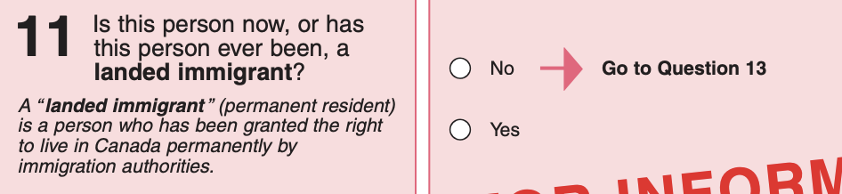

# Canada Questions on Citizenship (Naturlization)

## 1996 Census
- Coverage: 20%
- Questions: Country of citizenship and immigration status (past or present)
- Source: [1996 Canadian Census Short Form](http://www12.statcan.gc.ca/english/census01/info/96-2a-en.pdf) and [Long Form](http://www12.statcan.gc.ca/english/census01/info/96-2b-en.pdf)

## 2001 Census
- Coverage: 20%
- Questions: Country of citizenship and immigration status (past or present)
- Source: [2001 Canadian Census Short Form](http://www.statcan.gc.ca/imdb-bmdi/instrument/3901_Q1_V2-eng.pdf) and [Long Form](http://www23.statcan.gc.ca/imdb-bmdi/pub/instrument/3901_Q2_V2-eng.pdf)

## 2006 Census
- Coverage: 20%
- Questions: Country of citizenship and immigration status (past or present) (split between two pages)
- Source: [2006 Canadian Census Short Form](http://www23.statcan.gc.ca/imdb-bmdi/instrument/3901_Q1_V3-eng.pdf) and [Long Form](http://www23.statcan.gc.ca/imdb-bmdi/instrument/3901_Q2_V3-eng.pdf)

## 2011 Census
- Coverage: ~26% 
- Questions: Country of citizenship and immigration status (past or present) (split between two pages)
- Source: [2011 Canadian Census Form](http://www23.statcan.gc.ca/imdb-bmdi/instrument/3901_Q1_V4-eng.pdf) and [National Household Survey](http://www23.statcan.gc.ca/imdb-bmdi/instrument/5178_Q1_V1-eng.pdf)
- Note: There was no (compulsory) Census long form in 2011, there was a (voluntary) National Household Survey, with [lower response rates](https://www12.statcan.gc.ca/nhs-enm/2011/ref/about-apropos/nhs-enm_r012.cfm?Lang=E). The coverage rate is computed as (number of households) * sampling rate * weighted response rate = 13,320,614 * 34% * 77.2%

## 2016 Census
- Coverage: ~20% 
- Questions: Country of citizenship and immigration status (past or present) 
- Source: [2016 Canadian Census Short Form](http://www.statcan.gc.ca/eng/statistical-programs/instrument/3901_Q1_V5-eng.pdf) and [Long Form](http://www.statcan.gc.ca/eng/statistical-programs/instrument/3901_Q2_V4-eng.pdf)

