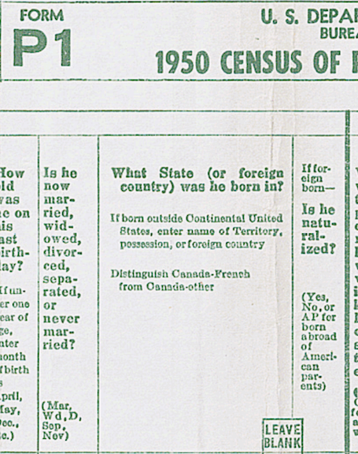
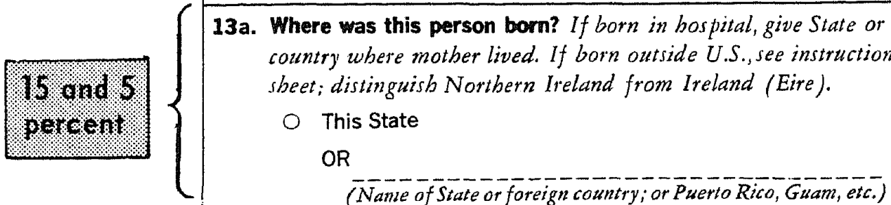

# USA Questions on Citizenship (Naturlization)

## 1950 Census
- Coverage: 100% 
- Questions: Place of birth and naturalization status
- Source: [1950 Census Population Questionnaire](https://www.census.gov/history/pdf/1950_population_questionnaire.pdf)

## 1960 Census
- Coverage: 0%
- Questions: NA
- Source [1960 Census of Population
and Housing Questionnaire](https://www.census.gov/history/pdf/1960censusquestionnaire-2.pdf)

## 1970 Census
- Coverage: 5%
- Questions: Place of birth (20%) and naturalization status (5%)
- Source [1970 Census Questionnaire](https://www.census.gov/history/pdf/1970_questionnaire.pdf)

## 1980 Census
- Coverage: 17%
- Questions: Place of birth and naturalization status 
- Source: [1980 Census Long and Short Form Questionnaires](https://www.census.gov/history/www/through_the_decades/questionnaires/1980_1.html)

## 1990 Census
- Coverage: 17%
- Questions: Place of birth and citizenship status 
- Source: [1990 Census Long Form](https://www.census.gov/history/pdf/1990_questionnaire.pdf) (no short form is archived)

## 2000 Census
- Coverage: 17%
- Questions: Place of birth and citizenship status 
- Source: [2000 Census Long and Short Forms](https://www.census.gov/history/www/through_the_decades/questionnaires/2000_2.html)

## 2005 American Community Survey
- Coverage: 15% 
- Questions: Place of birth and citizenship status
- Note: ACS estimates are period estimates that describe the average characteristics of
population and housing over a period of data collection. The Census Bureau, released its first 5-year estimates in December 2010. The 2013-2017 ACS 5-year estimates cover the time period from January 1, 2013 through December 31, 2017. Multiyear estimates give the average value is over the full data period. They cannot be used to say what is going on in any particular year in the period. [Sources: [1](https://www.census.gov/programs-surveys/acs/methodology/design-and-methodology.html), [2](https://www2.census.gov/programs-surveys/acs/tech_docs/accuracy/MultiyearACSAccuracyofData2017.pdf)]

## 2010 Census
- Coverage: 0%
- Questions: NA
- Source: [2010 Census Questionnaire](https://www.census.gov/history/www/through_the_decades/questionnaires/2010_overview.html)

## 2010-2017 American Community Survey
- Coverage: >15%
- Questions: Place of birth and citizenship status
- Note: Rolling 5-year estimates are released every year, at the same level of precision as previously achieved by the census long form (block group). 1-year estimates are available for areas with a population of at least 65,000, every year. Coverage increases over time.
